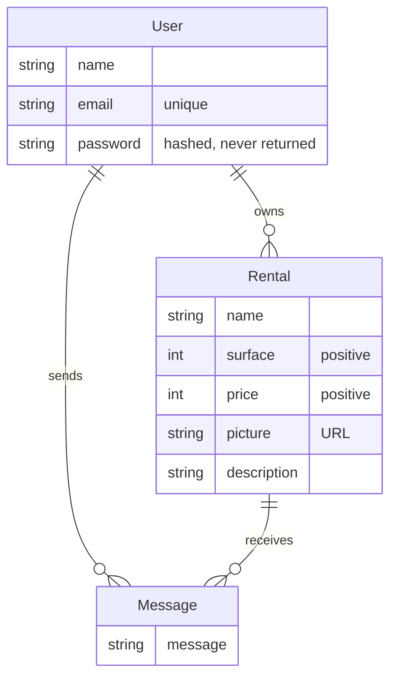

# ChâTop — API Definition

This definition is based on the Mockoon environment of the front-end repository, [`ressources/mockoon/rental-oc.json`](https://github.com/Almestra/chatop/blob/main/ressources/mockoon/rental-oc.json), extended with business rules and error cases.

## 1. Conventions

- **Base URL:** `http://localhost:3001/api`
- **Authentication:** every endpoint requires the header `Authorization: Bearer <token>`, except `register`, `login` and `GET /api/images/{filename}`, which is public because `` tags never send the token.
- **Pictures:** JPEG, PNG or WebP files of 5 MB at most, stored on the server under a generated name. In responses, `picture` holds the absolute URL of the file, of the form `http://localhost:3001/api/images/{filename}`.

## 2. Endpoints

Request and response objects are described in [section 3](#3-data-objects). Status codes in **bold** differ from the Mockoon environment (see [section 5](#5-differences-from-mockoon)).

| Endpoint | Description | Request | Success | Errors |
|---|---|---|---|---|
| `POST /api/auth/register` | Create an account (public) | `RegisterRequest` | **201** `AuthResponse` | 400, **409** |
| `POST /api/auth/login` | Log in (public) | `LoginRequest` | 200 `AuthResponse` | **400**, 401 |
| `GET /api/auth/me` | Get the logged-in user | - | 200 `UserResponse` | 401, **404** |
| `GET /api/rentals` | List all rentals | - | 200 `RentalsResponse` | 401 |
| `GET /api/rentals/{id}` | Get a rental | - | 200 `RentalResponse` | **400**, 401, **404** |
| `POST /api/rentals` | Create a rental | `RentalRequest` | **201** `MessageResponse` | **400**, 401, **413** |
| `PUT /api/rentals/{id}` | Update a rental | `RentalRequest` | 200 `MessageResponse` | **400**, 401, **403**, **404** |
| `POST /api/messages` | Send a message to a rental's owner | `MessageRequest` | **201** `MessageResponse` | 400, 401, **403** |
| `GET /api/user/{id}` | Get a user | - | 200 `UserResponse` | **400**, 401, **404** |
| `GET /api/images/{filename}` | **Added:** get a rental picture (public) | - | **200** image file | **404** |

## 3. Data objects

Object names are the future DTO names. All request fields are required; `picture` is only sent on creation, and ignored on update.

| Object | Fields | Rules |
|---|---|---|
| `RegisterRequest` | `name`, `email`, `password` | `email` must be a valid address. `name` and `email` are limited to 255 characters. |
| `LoginRequest` | `email`, `password` | `password` is limited to 72 characters. |
| `RentalRequest` | `name`, `surface`, `price`, `description`, `picture` | Sent as `multipart/form-data`. `surface` and `price` are positive integers. `name` is limited to 255 characters and `description` to 2000. |
| `MessageRequest` | `rental_id`, `user_id`, `message` | `rental_id` must be an existing rental and `user_id` the authenticated user. `message` is limited to 2000 characters. |
| `AuthResponse` | `token` | A signed JWT. |
| `UserResponse` | `id`, `name`, `email`, `created_at`, `updated_at` | - |
| `RentalResponse` | `id`, `name`, `surface`, `price`, `picture`, `description`, `owner_id`, `created_at`, `updated_at` | See the example below. |
| `RentalsResponse` | `rentals` | List of `RentalResponse`. |
| `MessageResponse` | `message` | `Rental created !`, `Rental updated !` or `Message send with success`: texts from Mockoon, displayed by the front-end. |

Example of `RentalResponse`:

```json
{
  "id": 1,
  "name": "test house 1",
  "surface": 432,
  "price": 300,
  "picture": "http://localhost:3001/api/images/{filename}",
  "description": "Lorem ipsum dolor sit amet…",
  "owner_id": 1,
  "created_at": "2026-09-27T10:15:30",
  "updated_at": "2026-09-27T10:15:30"
}
```

## 4. Error responses

Every error returns `{ "message": "…" }` with one of these status codes:

| Status | Case |
|---|---|
| 400 | missing or invalid field or picture, invalid id in the URL, unknown rental in a message |
| 401 | missing or invalid token, wrong email or password |
| 403 | update by someone other than the owner, `user_id` different from the authenticated user |
| 404 | unknown rental, user or picture |
| 409 | email already used |
| 413 | picture larger than 5 MB |
| 415 | body in another format than the expected one (JSON or `multipart/form-data`), on any endpoint with a body |
| 500 | unexpected error, on any endpoint |

## 5. Differences from Mockoon

Section 2 covers every route of the Mockoon environment. None of the differences below requires a front-end change: the front-end accepts any `2xx` status, never reads error bodies, and displays the dates and picture URLs it receives.

| Topic | Mockoon | This API |
|---|---|---|
| Status codes | `200`, `400` and `401` only | `201` on creation, new `400`, `403`, `404`, `409`, `413` and `415` cases |
| Login with a wrong email | `200`, because of a faulty Mockoon rule | `401` |
| Error body | empty, `{}` or `{ "message": "error" }` | `{ "message": "…" }` |
| Dates | `"2022/02/02"` | ISO-8601 |
| Pictures | external URLs, returned as an array by `GET /api/rentals/{id}` | uploaded files served by `GET /api/images/{filename}`, always a single URL |

## 6. Domain entities

Deduced from the Mockoon data, the Angular interfaces and the database schema provided with the front-end. Every entity also has an `id`, a `created_at` and an `updated_at`.



The owner of a rental is the user who created it, and only the owner can update it.

## 7. Spring Boot dependencies

| Dependency | Purpose |
|---|---|
| Spring Web | REST controllers, multipart upload, embedded Tomcat |
| Spring Data JPA | repositories and Hibernate |
| MySQL Driver | connection to MySQL |
| Spring Security | endpoint access rules, BCrypt password hashing |
| OAuth2 Resource Server | signing and verifying JWTs with a secret key, without an OAuth2 server |
| Validation | field checks (`@NotBlank`, `@Email`…), answered with `400` |
| `springdoc-openapi-starter-webmvc-ui` | Swagger UI and OpenAPI 3 documentation, added by hand because it is not in Spring Initializr |
| Lombok, DevTools (optional) | less boilerplate, automatic restart |
