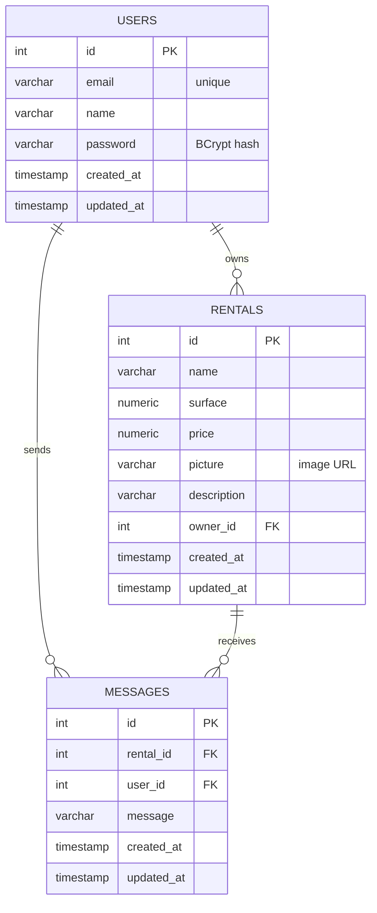

# ChâTop — Database

The MySQL database `chatop_db` is created by [`database.sql`](database.sql). Its tables, columns and relations are those of the schema provided with the front-end, [`ressources/sql/script.sql`](https://github.com/Almestra/chatop/blob/main/ressources/sql/script.sql), unchanged.

## 1. Installation

Requirements: MySQL 8, and an administrator account used only to run the script.

1. Open `docs/database.sql`, replace `CHANGE_ME` with a strong password, then run `mysql -u root -p < docs/database.sql`. Don't forget to put the placeholder back with `git restore docs/database.sql`.
2. Copy `.env.example` to `.env` and set `DB_PASSWORD` to the same password. Git ignores `.env`.
3. Log in as `chatop_user`, run `USE chatop_db;`, then `SHOW TABLES;` : the tables `MESSAGES`, `RENTALS` and `USERS` must be listed (in lowercase on Windows).

To start again from scratch, run `DROP DATABASE chatop_db;` and `DROP USER 'chatop_user'@'localhost';` with the administrator account, then run the script again.

## 2. Security

- The application connects with `chatop_user`, which can only read and write data in `chatop_db` (`SELECT`, `INSERT`, `UPDATE`, `DELETE`). It cannot change the schema or access other databases.
- No credential is committed: the script only contains a placeholder, and the real values live in `.env`.
- User passwords are stored in `USERS.password` as BCrypt hashes, never in clear text.

## 3. Schema

Text columns are `varchar(255)`, except `description` and `message` (`varchar(2000)`). Ids are auto-incremented integers.

## 4. Limitations of the provided schema

The schema is kept as provided. The application compensates for its limitations:

| Limitation | Consequence | Handling |
|---|---|---|
| `surface` and `price` are `numeric` without precision | MySQL only stores whole numbers, and accepts negative values | the API only accepts positive integers |
| Table names are uppercase | they are case-sensitive on Linux, but not on Windows | the application uses the exact table names |
| Columns are nullable, and `timestamp` columns have no default value | the database enforces neither required fields nor dates | the API validates fields and sets `created_at` and `updated_at` |